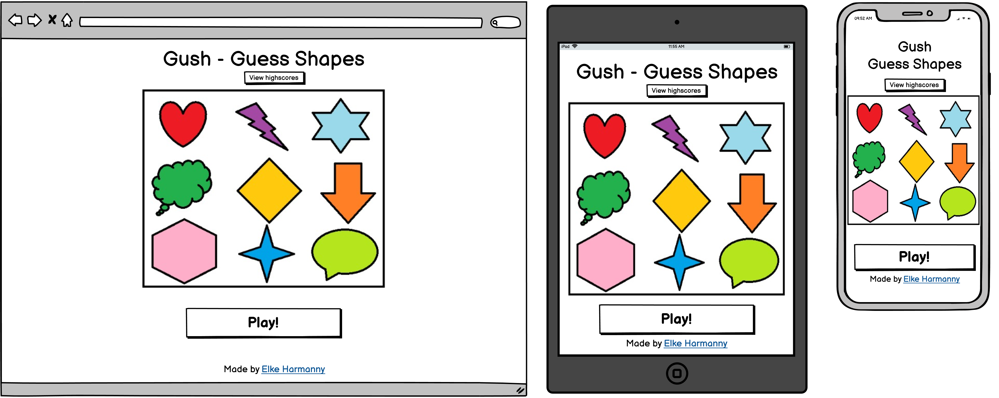
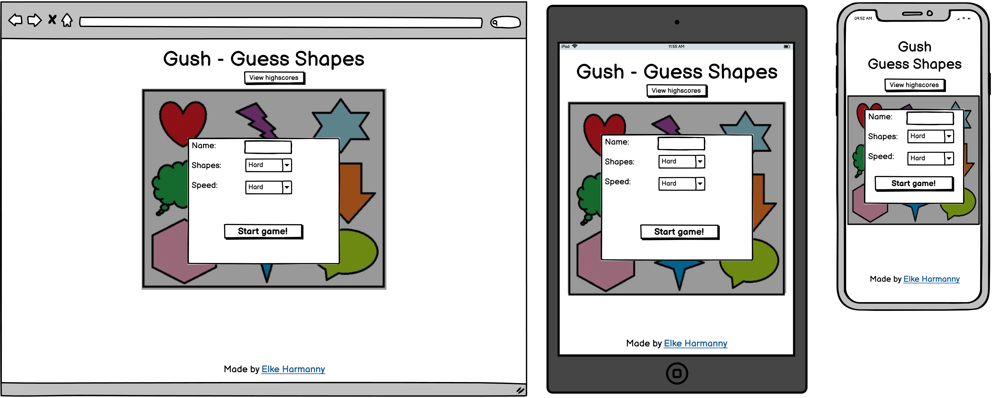
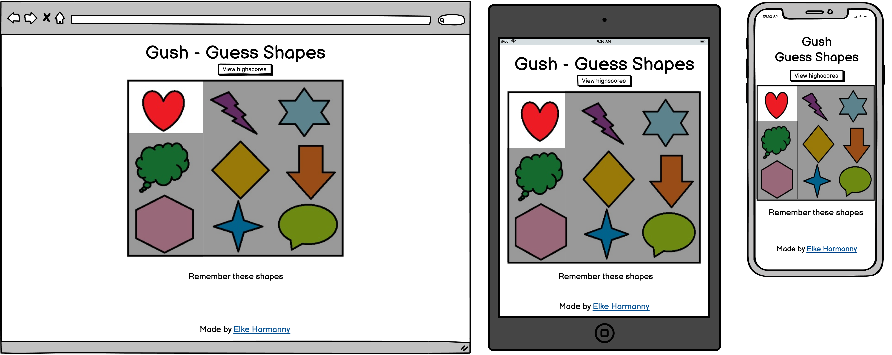
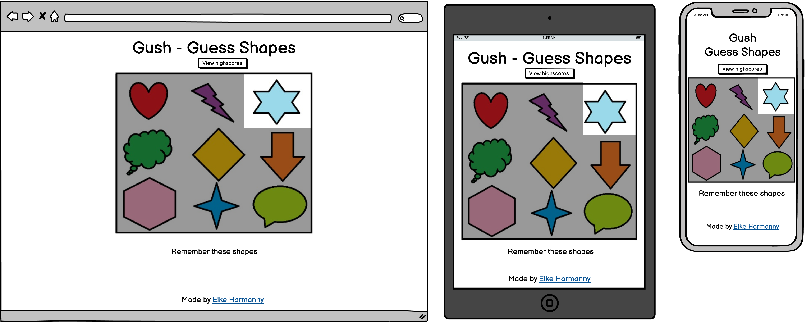
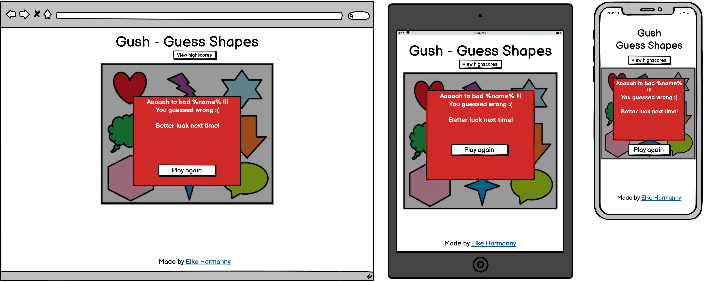
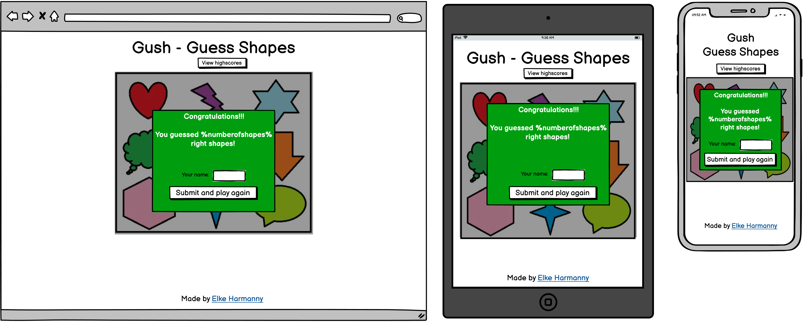
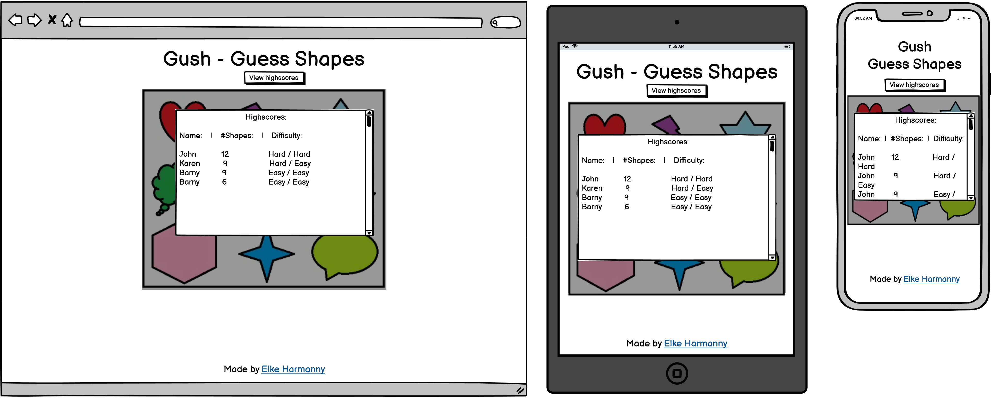

# Gush - Guess Pictures
Gush is a game where you are shown a number of shapes in rapid succession, and you need to click those shapes in the correct order afterwards. 

---

## UX

### User stories
- As a player of the game, I want to be able to see how I should play at first glance.
- As a player of the game, I want to be able to keep track of how I did, and view my highscores.

### Strategy
The goal of this website is to provide a place for the game 'Gush' to exist. This game itself meant as both entertainment and a light exercise in memory skills, mainly aimed at my nieces and nephews but also enjoyable for adults.

### Scope
Initially the site will contain one game. The game needs only one page, as it works with dynamic content that is displayed. There will be some features to expand upon the base game, such as highscores, and invite a friend. 

### Structure
As the site will feature one page with a single game on it, there will be no need for a menu. As the game itself will be flashy and draw focus, the rest of the page will be minimalistic to keep the users focus on the game. 

### Skeleton
1. Start page 
2. Setup page 
3. Playing - example 1 
4. Playing - example 2 
5. Submit answer 
6. Result - failed 
7. Result - succes 
8. Highscores 

### Surface
The website will feature soft, unobtrusive colors like off-white. This is so chosen because the shapes in the game will have strong vibrant colors to provide maximal contrast. The chosen font is Oswald. The shapes are created in MS Paint as this allows for simplistic shapes that are easily recognisable. This is important because the target audience is children. 

---

## Features

### Existing features
  - Highscores
    * Allows you to view previous highscores made on the computer via cookies
  - Dificulty settings
    * Allows adjusting of both the number of shapes and the speed at which they are shown. 

### Features Left to Implement
  - Dynamic number of shapes
    * For example start at 4 shapes, then go to 6 then 9 etc.. 
  - Check correct answer
    * After you click the wrong answer, you can click on a button to show you the remainder of the shapes you should've clicked.
  - Play again in highscores
    * A play again button in the highscores display panel would allow the player to quickly get back into the action.
  - Global highscores
    * You would then have the option of viewing your local highscores or the global ones.

---

## Technologies Used
Website is written using a combination of HTML5, CSS3 and Javascript. 
Libraries used are: 
- [JQuery 3.5.1](https://jquery.com/)
  * This makes creating the game logic faster and shorter. It also makes it easier to read for humans, which will be usefull in future collaborations. 

---

## Testing
### Code validators
* Tested for valid code using [w3 validator](https://validator.w3.org/nu/#textarea)
* Tested for accessibility using [achecker](https://achecker.ca/checker/index.php)

### User story tests

### Test script

## Bugs encountered
1. During a first run of the game, removeClass() would throw an error
    - shapeID is always empty during the first run in the interval (). Added an if statement to only removeClass() when it isn't empty.
2. During a run, the same number could be generated twice in a row. This would result in no shape being highlighted
    - Added a do while loop before adding the class, so the number is checked against the number of the previous run first. 
3. When submitting the first highscore, the fade in effect doesn't work
    - Highlighting is dependent upon the input being an object. Changed setHighscores() function to always fill the object so it is passed through to highlightHighscore()
4. When playing on mobile, the hover effect for the shapes stays after the round, causing confusion.
    - Changed the effect to only be active on larger then mobile screens, as the issue is touch vs. mouse.
5. When playing on mobile, the playing sound can be delayed causing it to only start playing when the round has already begun. 
    - Preloaded the playing audio element in the html, and call it using js. This ensures the data is present when needed instead of lazy loading. 
---

## Deployment
### Deployment to GitHub pages
When deploying to GitHub pages, I've used the following steps
1. Login to [GitHub](https://github.com)
2. Browse to the [repository](https://github.com/ElkeJohannes/Gush)

### Fork this repository
1. Login to [GitHub](https://github.com)
2. Browse to the [repository](https://github.com/ElkeJohannes/Gush)
3. On the top right of the page, there should be a button that says 'Fork'. Click on this button to fork a copy of the site to your own repositories. 

### Local deployment
To deploy this website locally or on another hosted webserver, all that is needed is a working webserver. Provided you have that, proceed with the steps below.
1. Go to the [repository](https://github.com/ElkeJohannes/Gush)
2. Click on the green button that says Code
3. Click the bottom option to download the ZIP
4. Unpack the zip file on your webserver in the folder where you want to run it from

Alternatively you can clone this repository by using the GitHub cli. Should you wish to do so, use this command: gh repo clone ElkeJohannes/Gush

---

## Credits

### Content
* All text is written by myself

### Media
* Amazing shapes designed and created by myself in MS Paint
* Audio is from [MixKit](https://mixkit.co/free-sound-effects/game/)

### Acknowledgements
* [learn.jquery](https://learn.jquery.com/) that provided me with lots of extra info on how to use jquery.
* [w3schools](https://wwww.w3schools.com) for being my 'cheat sheet' on all things html, css and javascript.
* [This stackoverflow thread](https://stackoverflow.com/questions/9419263/how-to-play-audio) with the info on how to play audio from javascript.
* [Colorhunt](https://colorhunt.co) for the color scheme used.
* [Brian's code](https://brianscode.com/html-table-rounded-corners-example/) For the code to make table have round corners.    