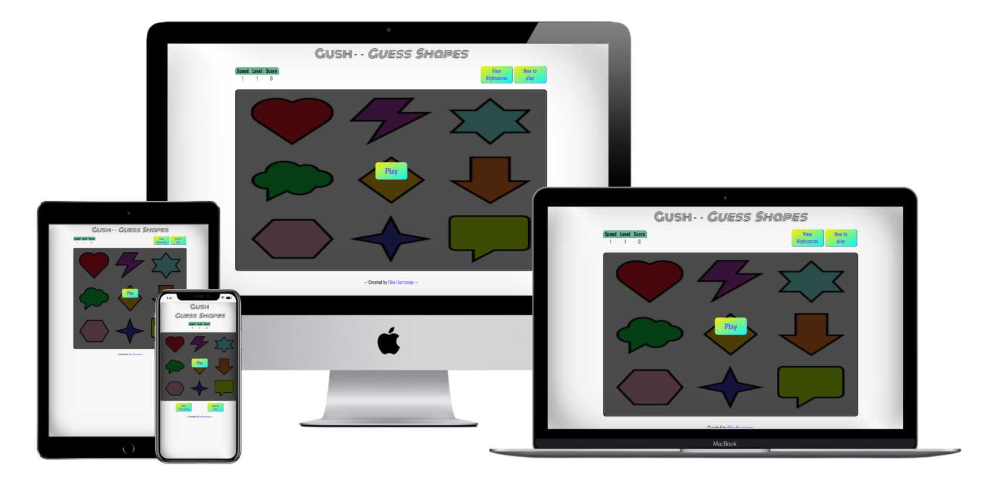

---

Gush is a game where a number of random shapes will be highlighted. Your goal is to remember which ones were highlighted, and click on those in the same order afterwards.

**-- [Play the game](https://elkejohannes.github.io/Gush/) --**

---

## Table of contents

**

User Experience
**
  - [User stories](#user-stories)
  - [Strategy](#strategy)
  - [Scope](#scope)
  - [Structure](#structure)
  - [Skeleton](#skeleton)
  - [Surface](#surface)

**

Features
**
  - [Existing features](#existing-features)
  - [Future features](#future-features)

**

Technologies Used
**
  - [Languages](#languages)
  - [Libraries, Frameworks and programs](#Libraries,-Frameworks-and-programs)

**

Testing
**
  - [Test documentation](https://github.com/ElkeJohannes/Gush/blob/master/TESTING.md)

**

Deployment
**
  - [Deployment to GitHub pages](#deployment-to-github-pages)
  - [Forking this repository](#forking-this-repository)
  - [Local deployment](#local-deployment)

**

Credits
**
  - [Text](#text)
  - [Media](#media)
  - [Acknowledgements](#acknowledgements)

---

## &rarr; **User Experience**

### **<ins>User stories</ins>**
Below user stories are all written from the perspective of someone visiting the website to play the game. Therefore the actor has been shortened to 'I'.
- I want to receive instructions on how to play the game.
- I want to revisit the instructions, should I feel the need. 
- I want to be able to keep track of how I'm doing in the current game.
- I want to be able to view my highscores.
- I want to be able to start a new game, after finishing one.

### **<ins>Strategy</ins>**
The game is meant as an entertaining way to exercise the brain of (mainly) my nieces and nephews, who are the target audience. It will do this using shapes, colors and sounds that appeal to children to captivate the attention. Meanwhile the game will be hard enough to be challenging and provide an actual workout. 

### **<ins>Scope</ins>**
Initially the site will contain one game. The game needs only one page, as it works with dynamic content that is displayed inside the game area. Using an overlay there will be windows that give to, or take information from, the user. These windows are the game results, the highscores and a tutorial. Highscores will be contained to whatever device the user is playing on. This is because global highscores demand server side storage, which is deemed beyond the current scope of the project. 

### **<ins>Structure</ins>**
As the site will feature one page with a single game on it, there will be no need for a menu. As the game itself will be flashy and draw focus, the rest of the page will be minimalistic to keep the users' focus on the game. The amount of always visible buttons will be kept to a minimum. There will be a start button displayed over the game area that disappears when the game is running. At the top, there will be some information about the currently running game such as score and level. 

### **<ins>Skeleton</ins>**
The following wireframes were made using [Balsamiq](https://balsamiq.com/) to give a rough idea of the project. No part of these is definitive, and especially the colors and fonts will vary from the end result. 
- [Start page](assets/wireframes/start.png)
- [Playing - example 1](assets/wireframes/playing1.png)
- [Playing - example 2](assets/wireframes/playing2.png)
- [Game results](assets/wireframes/game-results.png)
- [Highscores](assets/wireframes/highscores.png)

### **<ins>Surface</ins>**
The website will feature flashy and bright colors. This, combined with the game sounds will provide a retro or arcade look and feel. The shapes are created in MS Paint 3D as this allows for simplistic shapes that are easily recognisable. This is important because the main target audience is children. 

#### **Fonts**
The font of the main title is Monoton, to provide the retro look. This font is however not very clear and easily readable, which is why for all other text on the site, the chosen font is Oswald.

---

## &rarr; **Features**

#### **<ins>Existing features</ins>**
|#|Name|Description|
|-|-|-|
|1|Green dots on Hover|When hovering over a shape on a device > mobile, green dots will outline the shape.|
|2|Highscores|A screen in an overlay, showing the local highscores.|
|3|Responsive design|On mobile, the highscores and tutorial buttons appear below the game area.|
|4|Tutorial with gif|When loading the website for the first time on a device, the tutorial appears. This has a basic instruction and a gif playing to demonstrate how to play.|
|5|Current game information|Counters at the top (middle on mobile, left on > mobile) that show current Speed, level and score.|

#### **<ins>Future features</ins>**
|#|Name|Description|
|-|-|-|
|1|Dynamically increasing shapes|The number of shapes in the game area can increase during gameplay, to further increase complexity.|
|2|View correct answer|After you click the wrong answer, the ability to click on a button to show the remainder of the shapes you should've clicked.|
|3|Global highscores|An addition to the highscores screen which would give you the option of viewing the local highscores or the global ones.|

---

## &rarr; **Technologies Used**
### **<ins>Languages</ins>**

| 
HTML5
 | 
CSS3
 | 
Javascript
 |
|-|-|-|
|  |  |  |

### **<ins>Libraries, Frameworks and programs</ins>**
- [JQuery 3.5.1](https://jquery.com/)
  * Used throughout the game.js file for easier DOM access.
- [XBox game bar](https://www.microsoft.com/en-us/p/xbox-game-bar/9nzkpstsnw4p?activetab=pivot:overviewtab)
  * Used to do a screen recording to create the tutorial.
- [Video to Gif](https://hnet.com/video-to-gif/)
  * Used to convert the tutorial recording to a gif.
- [MS Paint 3D](https://www.microsoft.com/en-us/p/paint-3d/9nblggh5fv99?activetab=pivot:overviewtab)
  * To create the shapes with a transparant background.
- [Multi device mockup generator](http://techsini.com/multi-mockup/index.php)
  * Used to create the header image of this readme file.
- [Favicon generator](https://favicon.io/favicon-generator/)
  * Used to create a custom favicon.
---

## &rarr; **Deployment** 
### **<ins>Deployment to GitHub pages</ins>**
When deploying to GitHub pages, I've used the following steps
1. Login to [GitHub](https://github.com)
2. Browse to the [repository](https://github.com/ElkeJohannes/Gush)

### **<ins>Forking this repository</ins>**
1. Login to [GitHub](https://github.com)
2. Browse to the [repository](https://github.com/ElkeJohannes/Gush)
3. On the top right of the page, there should be a button that says 'Fork'. Click on this button to fork a copy of the site to your own repositories. 

### **<ins>Local deployment</ins>**
To deploy this website locally or on another hosted webserver, all that is needed is a working webserver. Provided you have that, proceed with the steps below.
1. Go to the [repository](https://github.com/ElkeJohannes/Gush)
2. Click on the green button that says Code
3. Click the bottom option to download the ZIP
4. Unpack the zip file on your webserver in the folder where you want to run it from

Alternatively you can clone this repository by using the GitHub cli. Should you wish to do so, use this command: gh repo clone ElkeJohannes/Gush

---

## &rarr; **Credits**

### **<ins>Text</ins>**
* All text is written by myself

### **<ins>Media</ins>**
* Audio is from [MixKit](https://mixkit.co/free-sound-effects/game/)
* The HTML5, CSS3 and Javascript images used in this readme file are from [Wikimedia](https://commons.wikimedia.org/wiki/Main_Page)

### **<ins>Acknowledgements</ins>**
* [learn.jquery](https://learn.jquery.com/) that provided me with lots of extra info on how to use jquery.
* [w3schools](https://wwww.w3schools.com) for being my 'cheat sheet' on all things html, css and javascript.
* [This stackoverflow thread](https://stackoverflow.com/questions/9419263/how-to-play-audio) with the info on how to play audio from javascript.
* [Colorhunt](https://colorhunt.co) for the color scheme used.
* [Brian's code](https://brianscode.com/html-table-rounded-corners-example/) For the code to make tables have round corners.
* [Lucy Jones](https://github.com/Lucyjpjones/lj-fscr) for inspiration on the various README.MD tricks you can do to make the file prettier.
* [W3 org article](https://www.w3.org/2005/10/howto-favicon) for instructions on how to add a favicon.