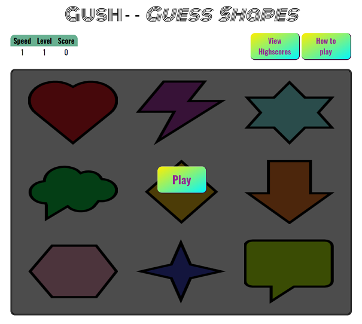

---

Gush is a game where a number of random shapes will be highlighted. Your goal is to remember which ones were highlighted, and click on those in the same order afterwards.

**-- [Play the game](https://elkejohannes.github.io/Gush/) --**

---

## Table of contents

**

User Experience
**
  - [User stories](#user-stories)
  - [Strategy](#strategy)
  - [Scope](#scope)
  - [Structure](#structure)
  - [Skeleton](#skeleton)
  - [Surface](#surface)

**

Features
**
  - [Existing features](#existing-features)
  - [Future features](#future-features)

**

Technologies Used
**
  - [Languages](#languages)
  - [Libraries & Frameworks](#libraries-&-frameworks)

**

Testing
**
  - [Test documentation](https://github.com/ElkeJohannes/Gush/blob/master/TESTING.md)

**

Deployment
**
  - [Deployment to GitHub pages](#deployment-to-github-pages)
  - [Forking this repository](#forking-this-repository)
  - [Local deployment](#local-deployment)

**

Credits
**
  - [Text](#text)
  - [Media](#media)
  - [Acknowledgements](#acknowledgements)

---

## &rarr; **User Experience**

### **<ins>User stories</ins>**
Below user stories are all written from the perspective of someone visiting the website to play the game. Therefore the actor has been shortened to 'I'.
- I want to receive instructions on how to play the game.
- I want to revisit the instructions, should I feel the need. 
- I want to be able to keep track of how I'm doing in the current game.
- I want to be able to view my highscores.
- I want to be able to start a new game, after finishing one.

### **<ins>Strategy</ins>**
The goal of this website is to provide a place for the game 'Gush' to exist. This game itself meant as both entertainment and a light exercise in memory skills, mainly aimed at my nieces and nephews but also enjoyable for adults.

### **<ins>Scope</ins>**
Initially the site will contain one game. The game needs only one page, as it works with dynamic content that is displayed. There will be some features to expand upon the base game, such as highscores, and invite a friend. 

### **<ins>Structure</ins>**
As the site will feature one page with a single game on it, there will be no need for a menu. As the game itself will be flashy and draw focus, the rest of the page will be minimalistic to keep the users focus on the game. 

### **<ins>Skeleton</ins>**
1. [Start page](assets/wireframes/start.png)
2. [Playing - example 1](assets/wireframes/playing1.png)
3. [Playing - example 2](assets/wireframes/playing2.png)
6. [Result - failed](assets/wireframes/result-failed.png)
8. [Highscores](assets/wireframes/highscores.png)

### **<ins>Surface</ins>**
The website will feature soft, unobtrusive colors like off-white. This is so chosen because the shapes in the game will have strong vibrant colors to provide maximal contrast. The chosen font is Oswald. The shapes are created in MS Paint as this allows for simplistic shapes that are easily recognisable. This is important because the target audience is children. 

---

## &rarr; **Features**

### **<ins>Existing features</ins>**
  - Highscores
    * Allows you to view previous highscores made on the computer via cookies
  - Dificulty settings
    * Allows adjusting of both the number of shapes and the speed at which they are shown. 

### **<ins>Future features</ins>**
  - Dynamic number of shapes
    * For example start at 4 shapes, then go to 6 then 9 etc.. 
  - Check correct answer
    * After you click the wrong answer, you can click on a button to show you the remainder of the shapes you should've clicked.
  - Global highscores
    * You would then have the option of viewing your local highscores or the global ones.

---

## &rarr; **Technologies Used**
### **<ins>Languages</ins>**
Website is written using a combination of HTML5, CSS3 and Javascript. 

### **<ins>Libraries & Frameworks</ins>**
Libraries used are: 
- [JQuery 3.5.1](https://jquery.com/)
  * This makes creating the game logic faster and shorter. It also makes it easier to read for humans, which will be usefull in future collaborations. 

---

## &rarr; **Deployment** 
### **<ins>Deployment to GitHub pages</ins>**
When deploying to GitHub pages, I've used the following steps
1. Login to [GitHub](https://github.com)
2. Browse to the [repository](https://github.com/ElkeJohannes/Gush)

### **<ins>Forking this repository</ins>**
1. Login to [GitHub](https://github.com)
2. Browse to the [repository](https://github.com/ElkeJohannes/Gush)
3. On the top right of the page, there should be a button that says 'Fork'. Click on this button to fork a copy of the site to your own repositories. 

### **<ins>Local deployment</ins>**
To deploy this website locally or on another hosted webserver, all that is needed is a working webserver. Provided you have that, proceed with the steps below.
1. Go to the [repository](https://github.com/ElkeJohannes/Gush)
2. Click on the green button that says Code
3. Click the bottom option to download the ZIP
4. Unpack the zip file on your webserver in the folder where you want to run it from

Alternatively you can clone this repository by using the GitHub cli. Should you wish to do so, use this command: gh repo clone ElkeJohannes/Gush

---

## &rarr; **Credits**

### **<ins>Text</ins>**
* All text is written by myself

### **<ins>Media</ins>**
* Amazing shapes created by myself in MS Paint 3D
* Audio is from [MixKit](https://mixkit.co/free-sound-effects/game/)

### **<ins>Acknowledgements</ins>**
* [learn.jquery](https://learn.jquery.com/) that provided me with lots of extra info on how to use jquery.
* [w3schools](https://wwww.w3schools.com) for being my 'cheat sheet' on all things html, css and javascript.
* [This stackoverflow thread](https://stackoverflow.com/questions/9419263/how-to-play-audio) with the info on how to play audio from javascript.
* [Colorhunt](https://colorhunt.co) for the color scheme used.
* [Brian's code](https://brianscode.com/html-table-rounded-corners-example/) For the code to make tables have round corners.
* [Lucy Jones](https://github.com/Lucyjpjones/lj-fscr) for inspiration on the various README.MD tricks you can do to make the file prettier.