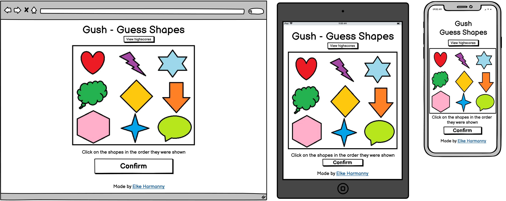
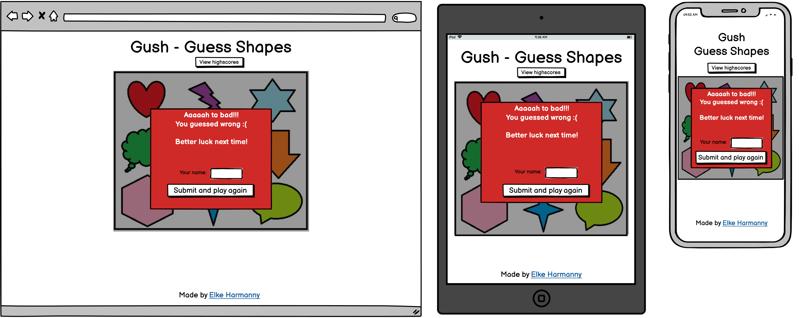

# Gush - Guess Pictures
Gush is a game where you are shown a number of shapes in rapid succession, and you need to click those shapes in the correct order afterwards. 

---

## UX

### User stories
- As a player of the game, I want to be able to see how I should play at first glance.
- As a player of the game, I want to be able to keep track of how I did, and view my highscores.

### Strategy
The goal of this website is to provide a place for the game 'Gush' to exist. This game itself meant as both entertainment and a light exercise in memory skills, mainly aimed at my nieces and nephews but also enjoyable for adults.

### Scope
Initially the site will contain one game. The game needs only one page, as it works with dynamic content that is displayed. There will be some features to expand upon the base game, such as highscores, and invite a friend. 

### Structure
As the site will feature one page with a single game on it, there will be no need for a menu. As the game itself will be flashy and draw focus, the rest of the page will be minimalistic to keep the users focus on the game. 

### Skeleton
1. Start page 
2. Setup page 
3. Playing - example 1 
4. Playing - example 2 
5. Submit answer 
6. Result - failed 
7. Result - succes 
8. Highscores 

### Surface
The website will feature soft, unobtrusive colors like off-white. This is so chosen because the shapes in the game will have strong vibrant colors to provide maximal contrast. The chosen font is Oswald. The shapes are created in MS Paint as this allows for simplistic shapes that are easily recognisable. This is important because the target audience is children. 

---

## Features

### Existing features
  - Highscores
    * Allows you to view previous highscores made on the computer via cookies
  - Dificulty settings
    * Allows adjusting of both the number of shapes and the speed at which they are shown. 

### Features Left to Implement
Website is written using a combination of HTML5, CSS3 and Javascript. 
Libraries used are: 
- [JQuery 3.5.1](https://jquery.com/)
  * This makes creating the game logic faster and shorter. It also makes it easier to read for humans, which will be usefull in future collaborations. 

---

## Technologies Used

---

## Testing
### Code validators
* Tested for valid code using [w3 validator](https://validator.w3.org/nu/#textarea)
* Tested for accessibility using [achecker](https://achecker.ca/checker/index.php)

### User story tests

### Test script

## Bugs encountered

    
---

## Deployment
### Deployment to GitHub pages
When deploying to GitHub pages, I've used the following steps
1. Login to [GitHub](https://github.com)
2. Browse to the [repository](https://github.com/ElkeJohannes/Gush)

### Fork this repository
1. Login to [GitHub](https://github.com)
2. Browse to the [repository](https://github.com/ElkeJohannes/Gush)
3. On the top right of the page, there should be a button that says 'Fork'. Click on this button to fork a copy of the site to your own repositories. 

### Local deployment
To deploy this website locally or on another hosted webserver, all that is needed is a working webserver. Provided you have that, proceed with the steps below.
1. Go to the [repository](https://github.com/ElkeJohannes/Gush)
2. Click on the green button that says Code
3. Click the bottom option to download the ZIP
4. Unpack the zip file on your webserver in the folder where you want to run it from

Alternatively you can clone this repository by using the GitHub cli. Should you wish to do so, use this command: gh repo clone ElkeJohannes/Gush

---

## Credits

### Content
* All text is written by myself

### Media
* Amazing shapes designed and created by myself in MS Paint

### Acknowledgements
