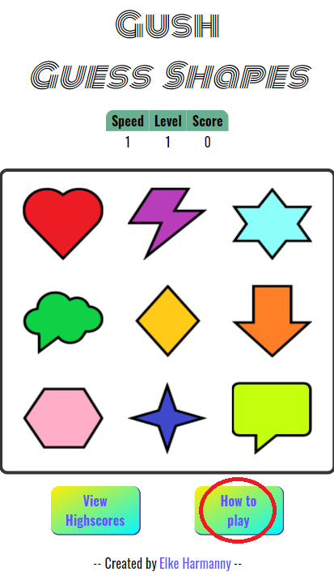

## <ins>**Testing**</ins>

---

**

Table of contents
**
  - [Code validation](#code-validation)
  - [User story tests](#user-story-tests)
  - [Manual testing script](#manual-testing-script)
  - [Feature tests](#feature-tests)
  - [Bugs](#bugs)

## &rarr; **Code validation**
- Tested for valid HTML code using [w3 validator](https://validator.w3.org/nu/)

- Tested for valid CSS code using [Jigsaw validator](https://jigsaw.w3.org/css-validator/)

    ** There were 5 warnings reported. These are all because I've chosen to use CSS variables.
    
- Tested for valid Javascript using [Jshint](https://jshint.com/)

## &rarr; **User story tests**
- I want to receive instructions on how to play the game.
    * When loading the game for the first time, you are presented with a tutorial text and gif.
    
- I want to revisit the instructions, should I feel the need. 
    * There is a button on the bottom right (mobile), or top right (> mobile) labeled 'How to play'. When clicking on this button, the tutorial window will appear again. 

        | 
Mobile
 | 
> Mobile
 |
        |-|-|
        |||

- I want to be able to keep track of how I'm doing in the current game.
    * Between the game title and the game area, there is an informational panel. The panel shows you the current game speed, level and your score so far.
    
        
- I want to be able to view my highscores.
    * There is a button on the bottom left (mobile), or top right (> mobile) labeled 'View highscores'. When clicking on this button, the highscores window will appear.

        | 
Mobile
 | 
> Mobile
 |
        |-|-|
        |||

- I want to be able to start a new game, after finishing one.
    * When you click on the wrong shape, the game will end and you will be presented with a screen to submit your highscore. You can either choose to submit your score, after which you will be taken to the highscore screen, where there is a play again button:
        

        Or you can close the submit highscore screen using the (X) close button, in which case you can click on the default Play button:
        

## &rarr; **Manual testing script**

## &rarr; **Feature tests**

## &rarr; **Bugs**
1. During a first run of the game, removeClass() would throw an error
    - shapeID is always empty during the first run in the interval (). Added an if statement to only removeClass() when it isn't empty.
2. During a run, the same number could be generated twice in a row. This would result in no shape being highlighted
    - Added a do while loop before adding the class, so the number is checked against the number of the previous run first. 
3. When submitting the first highscore, the fade in effect doesn't work
    - Highlighting is dependent upon the input being an object. Changed setHighscores() function to always fill the object so it is passed through to highlightHighscore()
4. When playing on mobile, the hover effect for the shapes stays after the round, causing confusion.
    - Changed the effect to only be active on larger then mobile screens, as the issue is touch vs. mouse.
5. When playing on mobile, the playing sound can be delayed causing it to only start playing when the round has already begun. 
    - Preloaded the playing audio element in the html, and call it using js. This ensures the data is present when needed instead of lazy loading. 
6. When playing on mobile, the tutorial text is not entirely visible..
    - This is due to the position: absolute. Fixed by setting the max width to 95vw. 
---